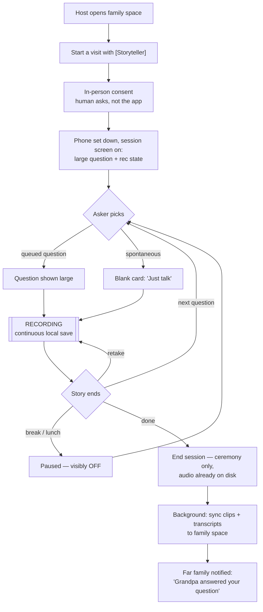
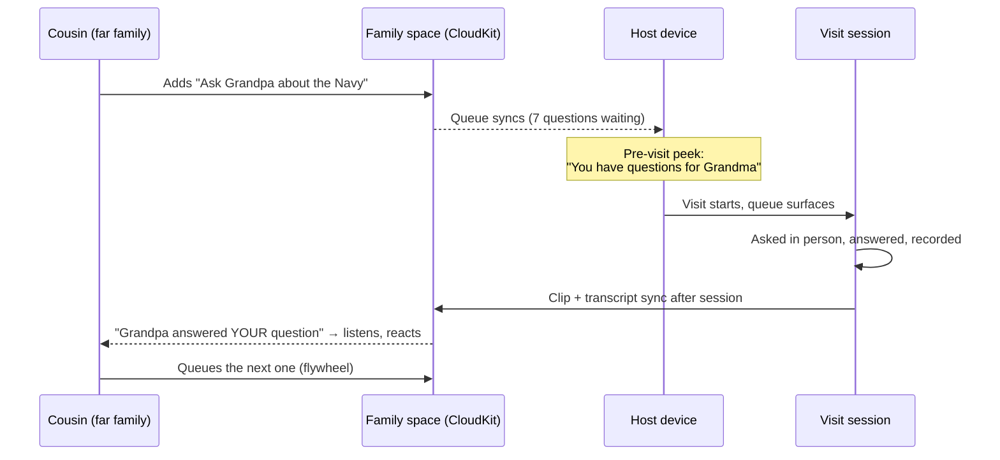
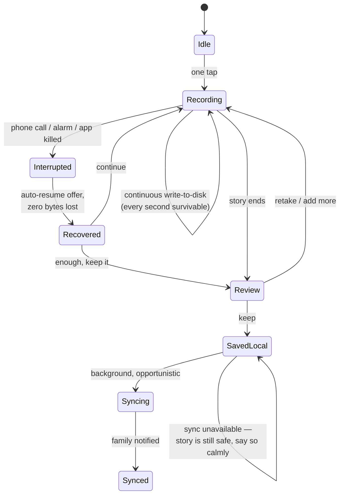

# Passalong — Journey Map & Core Flows (v1 draft)

Working artifact for thinking through the v1 workflow. Grounded in the standing decisions: in-person visits are the product ([[Passalong#Product intent]]), the elder has **no device in v1**, the phone must **recede** during the visit, capture is **never-lose-a-word**, and the family owns everything. Tear apart freely — this is a draft to argue with, not a spec.

## Actors

_These are **roles, not identities** — the grandparent↔grandchild casting below is v1's focus, not a model constraint (see the association-agnostic scope decision in [[Passalong]]). Any person can hold any role in a given session; the storyteller need not have an account at all._

- **Storyteller** — v1: the grandparent. No device, no account — a `Person` in the space, not necessarily a member. Sees the session screen across the table; owns the stories in every sense that matters. (Later castings: parent, great-aunt, mentor, veteran neighbor.)
- **Asker** — v1: a grandkid (anywhere from reading-age to teen). Browses/queues questions, asks them out loud at the visit, taps the big button.
- **Host** — the adult child: organizer, usually the payer, owns the device the session runs on, herds the moment into existence.
- **Far family** — aunts/uncles/cousins/other grandkids in other households. Queue questions between visits; listen to stories after; their visit turn comes later.

## Journey map

| Phase | Storyteller (no device) | Asker (grandkid) | Host (parent/organizer) | Far family |
|---|---|---|---|---|
| **Setup (once)** | Nothing. Maybe hears "we've got something fun for your visit." | Joins family space on their/parent's device; browses starter prompt packs. | Buys pass, creates space, invites adult relatives, sets storyteller's name/photo. | Accept invite (share link → ≤3 steps); see the empty archive and question queue. |
| **Between visits** | Nothing. (Remote-mode roadmap: daily question on their own device.) | Adds questions to the queue — own words or picked from packs ("Ask Grandpa about…"); attaches a photo ("ask about THIS one"). | Nudges kids to queue questions; refines wording; adds supporting material (photos, links); **prints the question sheet** before the visit. Prep can be a one-line note or a full collection — both valid. | Adds and refines questions from afar; contributes photos/links to others' questions; sees the prep grow; anticipation is the engagement loop. |
| **Visit — session start** | Sits down with coffee. Consents in person, human-to-human ("can we record some of your stories?"). | Picks the first question from the queue — their ritual moment. | Opens the space → "Start a visit with [Grandma]" → sets phone down on the table, screen facing the room. | (Not present — that's the point.) |
| **Visit — during** | Talks. Hears each question from the grandkid's mouth, not a screen (in table-audio arrangement, may also see the question in large type). Never asked to touch or look at anything. | Asks the question out loud — the asker IS the storyteller's interface; taps once when Grandma finishes ("next"); can toss in a spontaneous follow-up. | Mostly stays out of it. Handles the rare mechanical need (retake, pause for lunch). | — |
| **Visit — session end** | "Is that thing still going?" — clean, visible OFF state matters as much as ON. | Maybe records a thank-you or their own mini-story back (seed of bidirectionality). | Ends session; everything is already on disk (continuous save — ending is ceremony, not a save action). | — |
| **After** | Hears from family who listened; the payoff that makes the *next* session an easy yes. | Gets "Grandpa answered YOUR question" — closes their loop, fuels the next queue contribution. | Reviews clips; fixes transcript names; syncs happen in the background. | Notification: new stories. Listens; reacts; queues the next round — the flywheel. |
| **Ongoing** | Stories exist beyond them — the quiet, unstated promise. | Grows up with the archive. | Renews pass at the next gift season; orders keepsake artifacts (book, later). | Sealed time-capsule deliveries arrive on milestone dates. |
| **Curating (roadmap)** | Their voice, composed into something the family keeps forever. | Contributes favorites ("include the fishing story!"). | A **curator** (host or any member) selects, trims via transcript, orders — assembles the memory archive ("Grandpa's Navy Years"). | Receives the compilation at the milestone moment — birthday, anniversary, memorial. |

**Reading the map:** the engagement engine is the *queue* (between visits) and the *notification loop* (after) — the visit itself needs no engagement mechanics because the visit is the reward. If a design idea adds friction during "Visit — during," it loses regardless of what it adds elsewhere.

## Flow 1 — The visit session

## Flow 2 — The question queue (between visits)

## Flow 3 — Recording state machine (never-lose-a-word)

**The invariant this diagram encodes:** there is no state, transition, or failure in which committed audio is lost. Interruption is a *normal* state with a calm recovery path, not an error. The UI never makes the family anxious about sync — "saved on this phone, will share when online" is a success message, not a warning.

## Session-screen design principles (the device recedes)

1. **The human asker is the storyteller's interface — the screen serves whoever can see it.** In rear-camera arrangements (tripod, handheld) the camera faces the storyteller and the screen faces away, so the question travels *by voice*, from the grandkid, and the screen serves the operator (question to read aloud, rec state, timecode). In **selfie/couch mode** the screen faces both — question overlay readable by storyteller and asker together, teleprompter-style. In audio-on-the-table, everyone can glance at it. The rule that holds across all arrangements: the spoken question is always sufficient — a visible screen enhances, and its absence never breaks the session.
2. **One tap does the only thing** — next/done is a single large target a 7-year-old hits without reading; everything else hides behind an unobtrusive corner.
3. **Recording state is unmistakable at a glance** — both ON and OFF. "Is that thing recording?" must be answerable from across the room, both for trust during and relief after.
4. **The session is a room, not a feed** — no notifications, no badges, no archive browsing mid-session. The app does one thing while the family is together.
5. **Consent is human** — the app prompts the *asker* to ask permission out loud; it never speaks for the family or displays legalese at the storyteller.
6. **The screen serves two audiences without becoming busy** — the storyteller needs the question and the recording state, big and calm; the curator/note-taker needs a glanceable timecode. On a single device these are layout zones (question dominant and centered; timecode small, corner, readable up close but invisible from four feet), not competing screens. When a second device is present, the surfaces separate — working displays (notes, prominent timecode) move to the workers' own devices and the storyteller-facing screen gets even calmer.

**Session roles are capabilities, not devices (roadmap concept):** a session is one timeline; the roles — **recorder**, **prompter-display** (photos/videos facing the storyteller), **noter** (timestamped notes), **timekeeper** — stack onto however many devices are present. **The app never requires more than one device.** Canonical arrangements: *single phone/iPad on a tripod, rear camera* — steady video, screen facing the operator (likely the most common setup); *selfie/couch mode* — front camera with asker and storyteller side by side, **both in frame and both facing the screen**: the one single-device arrangement where the screen serves the storyteller too (teleprompter-style question overlay on the camera preview, controls at arm's reach, and an option to hide the self-view for storytellers it makes self-conscious — the both-together framing is also the archive's most treasured shot); *handheld* — the essentials still work; *multi-device* — roles spread out, each surface simplifies. Utility must be maximal at every device count, enhancing gracefully upward. And the storyteller-facing screen is **optional even when devices abound**: multi-device sessions *can* put a display in front of the storyteller (questions, photo prompts), but no role is ever mandatory — some storytellers will do their best telling with no screen anywhere near them, and the session should honor that as a first-class arrangement, not a degraded one.

## Open UX questions (argue these before sketching screens)

1. **Whose phone runs the session — Host's or Asker's?** Host's is likelier present and charged; Asker's makes the kid the protagonist. Maybe: either, and the archive doesn't care (any member device can host a session).
2. **The start ritual** — is "Start a visit" a deliberate ceremony (nice framing, one more step) or should opening the queue in Grandma's presence just *be* the start (zero friction, weaker moment)?
3. **Question order** — does the Asker pick freely (kid agency, possible chaos with 3 grandkids present) or does the queue propose an order (smoother, less ownership)? (The model now supports multiple askers per question — `QuestionAsker` rows — so "we all want to ask this one" is data, not a conflict; the open part is purely how the session screen handles turn-taking.)
4. **Spontaneous stories** — how prominent is "just talk" relative to the queue? The queue is the engine, but the best story of the visit is usually the unplanned one.
5. **Retakes in front of the storyteller** — does offering a "redo" respect Grandpa or embarrass him? May need to be host-only, after the fact, or absent entirely (keep everything; edit nothing).
6. **Transcript-name fixes** — host chore after the session (likely), but where does it live so it actually happens?
7. **Refinement etiquette** — can anyone edit anyone's question wording, or propose-and-accept? A 9-year-old's charmingly clumsy phrasing may be exactly what should be asked; over-polishing by adults could drain the prep of its voice. Lightest viable answer: edits allowed, original author visible, no approval machinery.
8. **Multiple storytellers in one visit** (Grandma *and* Grandpa at the table) — the data model now supports this outright (`StoryTeller` rows: a story can have both as co-tellers, or the session can alternate single-teller stories). The remaining question is pure UX: how does the session screen represent who's telling — explicit toggle, both-by-default for joint sessions, or host-assigned after the fact?

## Related
- [[Passalong]] — product intent, scope decisions this draft encodes
- [[CloudKit Spike Plan]] / [[CloudKit Spike Results]] — the sync layer under Flow 2 and 3
